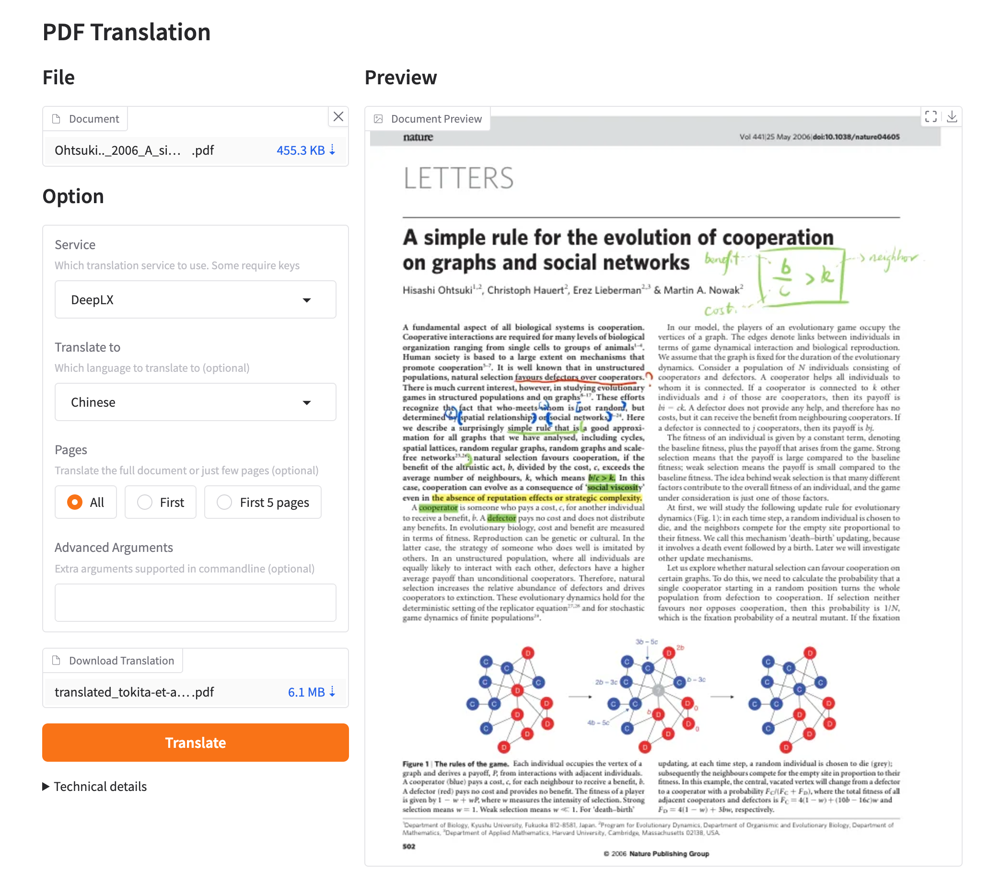
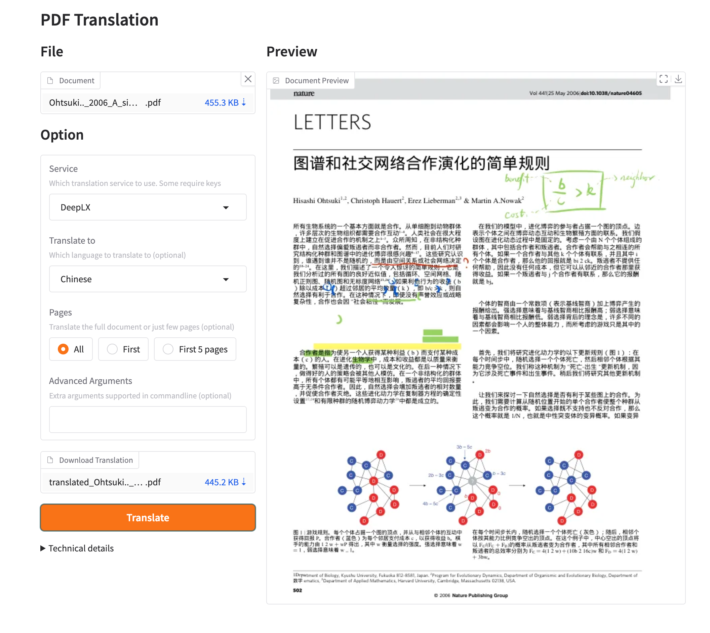

[**Iniziare**](./getting-started.md) > **Installazione** > **WebUI** _(current)_

---

### Utilizzo di GBabelDocUI tramite Webui

#### Come aprire la pagina WebUI:

Esistono diversi metodi per aprire l'interfaccia WebUI. Se stai utilizzando **Windows**, consulta [questo articolo](./INSTALLATION_winexe.md);

1. Python installato (versione 3.10 <= versione <= 3.12)

2. Installa il nostro pacchetto:

3. Inizia a utilizzare nel browser:

    ```bash
    gbabeldocui
    ```

4. Se il tuo browser non si è avviato automaticamente, vai a

    ```bash
    http://localhost:7860/
    ```

    Trascina il file PDF nella finestra e clicca `Translate`.

5. Se distribuisci GBabelDocUI con docker e stai utilizzando ollama come backend LLM di GBabelDocUI, dovresti inserire "Ollama host" con

   ```bash
   http://host.docker.internal:11434
   ```

> **Nota di sicurezza:** Ollama è un servizio lato server disponibile solo agli amministratori. L'endpoint privato `http://host.docker.internal:11434` viene rifiutato per impostazione predefinita. In una distribuzione attendibile, imposta `GBABELDOCUI_ALLOW_PRIVATE_ENDPOINTS=true` nell'ambiente del container. Questa impostazione allenta la protezione SSRF; non abilitarla se utenti non attendibili possono accedere a GBabelDocUI.

<!--  -->

### Configure the translation

Use the GBabelDocUI settings page to choose the translation service, source and target languages, PDF outputs, page range and advanced options. The selected settings are saved per user and are snapshotted when a task starts.

When running the Docker container, keep `./data` mounted to `/app/data`. The default Compose deployment listens on `127.0.0.1:7860`; use an HTTPS reverse proxy for public access. The translation executor is designed for one application process and one shared data directory.
## Preview## Anteprima




<div align="right"> 
<h6><small>Parte del contenuto di questa pagina è stata tradotta da GPT e potrebbe contenere errori.</small></h6>